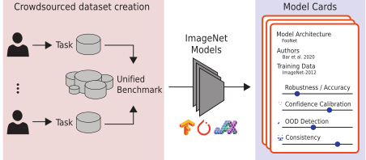

# Shift happens: Crowdsourcing metrics and test datasets beyond ImageNet

*ICLR 2022 workshop proposal*

While the popularity of robustness benchmarks and new test datasets increased over the past years, the performance of computer vision models is still largely evaluated on ImageNet directly, or on simulated or isolated distribution shifts like in ImageNet-C.
The goal of this two-stage workshop is twofold:
First, we aim to enhance the landscape of robustness evaluation datasets for computer vision and devise new test settings and metrics for quantifying desirable properties of computer vision models.
Second, we expect that these improvements in the model evaluation lead to a better guided and, thus, more efficient phase for the development of new models. This incentivizes development of models and inference methods with meaningful improvements over existing approaches  with respect to a broad scope of desirable properties.
Our goal is to bring the robustness, domain adaptation, and out-of-distribution detection communities together to work on a new broad-scale benchmark that tests diverse aspects of current computer vision models and guides the way towards the next generation of models.

|  | 
|:--:| 
| *Illustration of the envisioned procedure and outcome of this workshop: We will crowdsource and curate a collection of tasks and corresponding datasets highlighting interesting aspects of ImageNet-scale models. A set of reference models will be evaluated on these datasets during the benchmark, yielding an initial set of scorecards for commonly used ImageNet models. Following the benchmark creation, more models and new techniques can be evaluated, enabling a more holistic view on the performance of practically relevant computer vision models.* |

## Submissions & Information

The benchmark will be available on https://github.com/shift-happens-benchmark/iclr-2022
